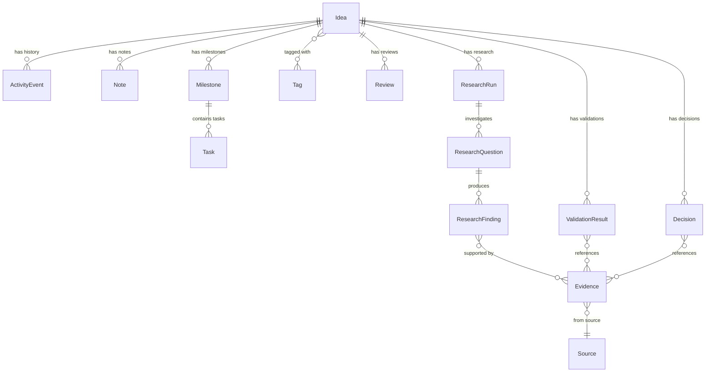

# Domain Model

## Entity Relationship Overview



---

## Idea

The central entity. Represents a raw or structured idea moving through a lifecycle.

### Fields

| Field | Type | Description |
|-------|------|-------------|
| `id` | UUID/int | Primary key |
| `title` | string | Short title |
| `raw_description` | text | Original unstructured input |
| `structured_description` | JSON/text | AI-structured output (problem, opportunity, etc.) |
| `status` | enum | Current lifecycle state |
| `source` | enum | How the idea was captured |
| `created_at` | datetime | Creation timestamp |
| `updated_at` | datetime | Last modification |
| `last_reviewed_at` | datetime | Last review timestamp |

### Source Values

| Value | Meaning |
|-------|---------|
| `MANUAL` | Created through the full form |
| `QUICK_CAPTURE` | Created through quick capture (title only) |
| `IMPORT` | Imported from external source |
| `API` | Created via API |

### Lifecycle States

```
INBOX ──────▶ STRUCTURED ──────▶ EXPLORING ──────▶ VALIDATING
                                                       │
                                                       ▼
                                                  COMMITTED
                                                       │
                                                       ▼
                                                   BUILDING
                                                       │
                                                       ▼
                                                   LAUNCHED

Any state can transition to:
  PAUSED ──▶ (return to previous state)
  KILLED
  ABANDONED
```

**State definitions:**

| State | Meaning |
|-------|---------|
| `INBOX` | Newly captured, not yet structured |
| `STRUCTURED` | AI or user has structured the idea |
| `EXPLORING` | Actively researching |
| `VALIDATING` | Testing assumptions and gathering evidence |
| `COMMITTED` | Decision made to build |
| `BUILDING` | Active development/execution |
| `LAUNCHED` | Shipped or deployed |
| `PAUSED` | Temporarily on hold (can resume) |
| `KILLED` | Deliberately stopped with reason |
| `ABANDONED` | Dropped without explicit decision |

Transitions are explicit and each creates an `ActivityEvent`.

---

## Activity Event

Append-only history of meaningful actions on an idea. Never deleted or modified.

| Field | Type | Description |
|-------|------|-------------|
| `id` | int | Primary key |
| `idea_id` | FK | Associated idea |
| `event_type` | enum | Type of event |
| `actor` | string | Who/what caused it (`user`, `ai`, `system`) |
| `timestamp` | datetime | When it happened |
| `metadata` | JSON | Event-specific details |

### Event Types

```
IDEA_CREATED
IDEA_UPDATED
AI_STRUCTURED
STATUS_CHANGED
NOTE_ADDED
TAG_ADDED
TAG_REMOVED
RESEARCH_STARTED
RESEARCH_COMPLETED
TASK_CREATED
TASK_COMPLETED
MILESTONE_COMPLETED
DECISION_MADE
VALIDATION_RECORDED
IDEA_PAUSED
IDEA_KILLED
IDEA_ABANDONED
REVIEW_COMPLETED
```

---

## Tag

Simple labeling system for categorization and filtering.

| Field | Type | Description |
|-------|------|-------------|
| `id` | int | Primary key |
| `name` | string | Tag name (unique, lowercase) |
| `created_at` | datetime | Creation timestamp |

Many-to-many relationship with Ideas via `idea_tags` join table.

---

## Note

Free-form notes attached to an idea.

| Field | Type | Description |
|-------|------|-------------|
| `id` | int | Primary key |
| `idea_id` | FK | Associated idea |
| `content` | text | Note content |
| `created_at` | datetime | Creation timestamp |
| `updated_at` | datetime | Last modification |

---

## Milestone

A high-level deliverable within an idea's execution plan.

| Field | Type | Description |
|-------|------|-------------|
| `id` | int | Primary key |
| `idea_id` | FK | Associated idea |
| `title` | string | Milestone title |
| `description` | text | Details |
| `status` | enum | `PENDING`, `IN_PROGRESS`, `DONE`, `CANCELLED` |
| `position` | int | Ordering |
| `created_at` | datetime | Creation timestamp |
| `completed_at` | datetime | Completion timestamp |

---

## Task

A concrete action item within a milestone.

| Field | Type | Description |
|-------|------|-------------|
| `id` | int | Primary key |
| `milestone_id` | FK | Parent milestone |
| `title` | string | Task title |
| `description` | text | Details |
| `status` | enum | See below |
| `priority` | enum | See below |
| `due_date` | date | Optional deadline |
| `estimated_effort` | string | Optional effort estimate |
| `is_ai_generated` | bool | Whether AI suggested this task |
| `created_at` | datetime | Creation timestamp |
| `completed_at` | datetime | Completion timestamp |

**Task statuses:** `TODO`, `IN_PROGRESS`, `DONE`, `BLOCKED`, `CANCELLED`

**Priorities:** `LOW`, `MEDIUM`, `HIGH`, `CRITICAL`

---

## Research Entities

### ResearchRun

| Field | Type | Description |
|-------|------|-------------|
| `id` | int | Primary key |
| `idea_id` | FK | Associated idea |
| `title` | string | Research run title |
| `status` | enum | `PLANNED`, `IN_PROGRESS`, `COMPLETED`, `CANCELLED` |
| `created_at` | datetime | Creation timestamp |
| `completed_at` | datetime | Completion timestamp |

### ResearchQuestion

| Field | Type | Description |
|-------|------|-------------|
| `id` | int | Primary key |
| `research_run_id` | FK | Parent research run |
| `question` | text | The question to investigate |
| `answer` | text | Summary answer |
| `status` | enum | `OPEN`, `ANSWERED`, `INCONCLUSIVE` |

### ResearchFinding

| Field | Type | Description |
|-------|------|-------------|
| `id` | int | Primary key |
| `research_question_id` | FK | Parent question |
| `finding` | text | What was found |
| `significance` | enum | `LOW`, `MEDIUM`, `HIGH` |

### Source

| Field | Type | Description |
|-------|------|-------------|
| `id` | int | Primary key |
| `url` | string | Source URL |
| `title` | string | Source title |
| `publisher` | string | Publisher name |
| `published_at` | datetime | Original publication date |
| `retrieved_at` | datetime | When we accessed it |

### Evidence

| Field | Type | Description |
|-------|------|-------------|
| `id` | int | Primary key |
| `claim` | text | The evidenced claim |
| `source_id` | FK | Supporting source |
| `research_finding_id` | FK | Associated finding |
| `idea_id` | FK | Associated idea |

---

## Validation Result

| Field | Type | Description |
|-------|------|-------------|
| `id` | int | Primary key |
| `idea_id` | FK | Associated idea |
| `category` | enum | See below |
| `score` | int | 1–10 |
| `confidence` | enum | `VERIFIED`, `UNVERIFIED` |
| `reasoning` | text | Explanation |
| `created_at` | datetime | Creation timestamp |

**Categories:** `PROBLEM_STRENGTH`, `CUSTOMER_NEED`, `MARKET_POTENTIAL`, `COMPETITION`, `TECHNICAL_FEASIBILITY`, `BUSINESS_MODEL`, `DISTRIBUTION`, `RISK`

Evidence linkage via `validation_evidence` join table.

---

## Decision

| Field | Type | Description |
|-------|------|-------------|
| `id` | int | Primary key |
| `idea_id` | FK | Associated idea |
| `decision_type` | enum | `BUILD`, `PAUSE`, `KILL`, `CONTINUE_RESEARCH`, `REVISIT_LATER` |
| `reason` | text | Why this decision was made |
| `created_at` | datetime | When decided |

Evidence linkage via `decision_evidence` join table.

---

## Review

| Field | Type | Description |
|-------|------|-------------|
| `id` | int | Primary key |
| `idea_id` | FK | Associated idea |
| `review_type` | enum | `PERIODIC`, `STALE`, `FORGOTTEN`, `WEEKLY` |
| `scheduled_at` | datetime | When review was due |
| `completed_at` | datetime | When completed |
| `notes` | text | Review notes |
| `outcome` | enum | `REVIEWED`, `PAUSED`, `KILLED`, `CONTINUED`, `CONVERTED_TO_TASK` |
